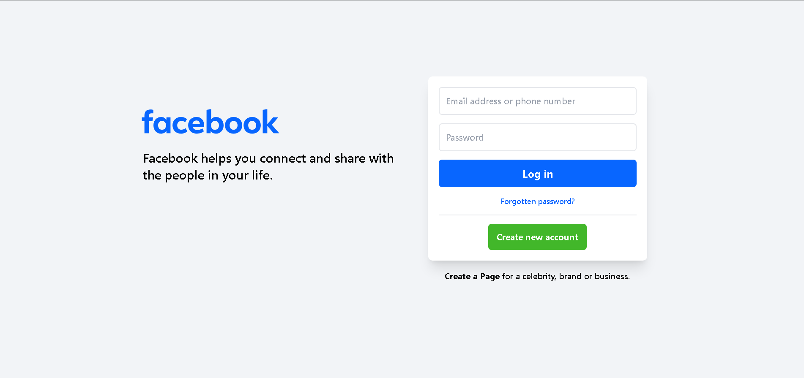
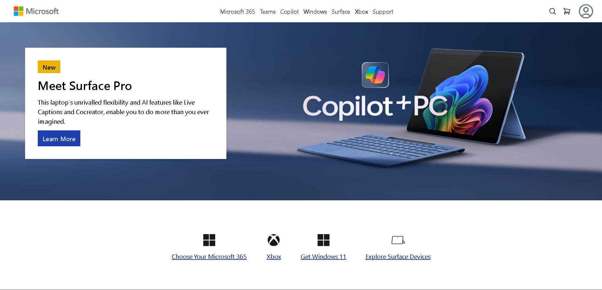

# Tailwind Study Material

Welcome to the Tailwind Study Material repository! This repository contains various resources and some basic projects/exercises.  

## Contents

- **Study Material**: Comprehensive notes and explanations on various Tailwind topics.

- **Projects**: Some basic projects/exercises like

  - Facebook Login Page Clone (Lec_14) :

   

  - Microsoft Homepage Clone (Lec_15) :

  

## Learning Source

- **CodeWithHarry**:
I have learned Tailwind from the amazing YouTube channel CodeWithHarry. [[Watch the playlist]](https://www.youtube.com/watch?v=L4_jarMnB0c&list=PLu0W_9lII9ahwFDuExCpPFHAK829Wto2O)

---